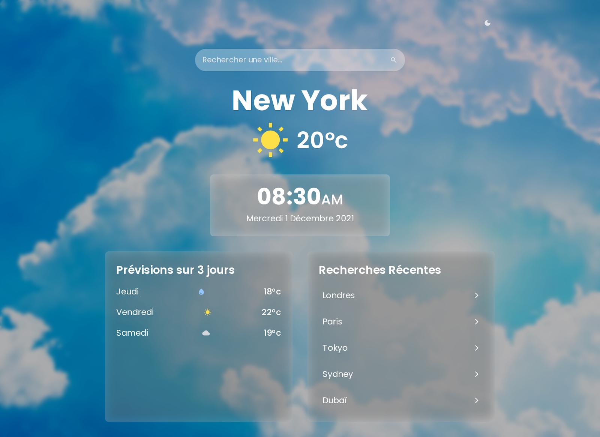
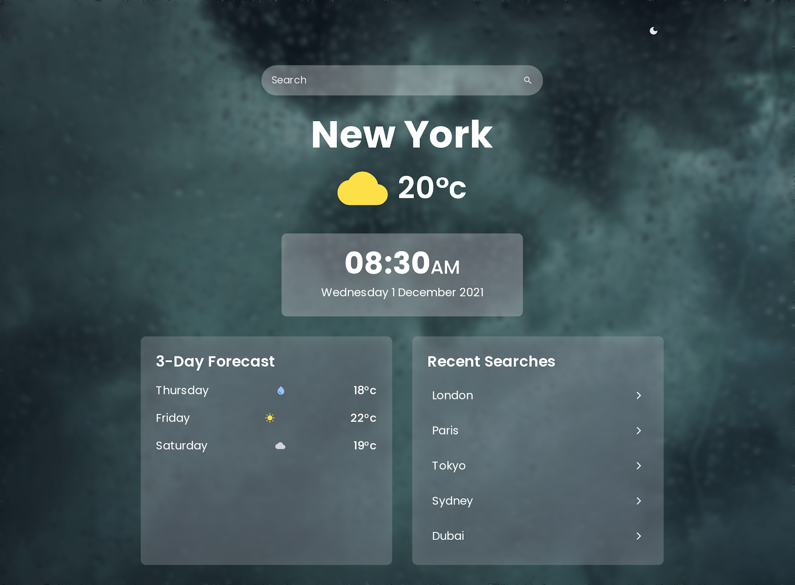

# Weather Dashboard React

Une application web moderne en React utilisant Vite qui permet d'afficher la météo d'une ville en temps réel, avec des fonctionnalités avancées pour enrichir l'expérience utilisateur.





## 🎯 Fonctionnalités

Vous trouverez les issues relatives à ces fonctionnalités avec le label `javascript`

### Recherche de ville & affichage météo

- Saisie du nom de la ville par l'utilisateur avec recherche debounced
- Utilisation de l'API météo pour récupérer les données (température, conditions météo)
- Affichage moderne et responsive de la météo actuelle

### Icônes météo + mise en forme

- Afficher une icône (SVG/PNG) selon les conditions météo (soleil, nuages, pluie, etc.)
- Mise en forme esthétique avec React components et CSS moderne

### Historique des recherches

- Conservation locale des dernières villes recherchées (via `localStorage`)
- Affichage de l'historique avec possibilité de cliquer sur une ville pour relancer la recherche

### Thème clair / sombre (dark mode)

- Interface avec bascule entre thème clair et sombre utilisant React state
- Styles adaptés pour les deux modes (couleurs, contrastes)

### Prévisions sur 5 jours + graphique

- Récupération des données météo pour les 5 prochains jours (températures, conditions)
- Affichage visuel via un graphique interactif avec Chart.js pour visualiser les tendances

## 🚀 Installation et Utilisation

### Prérequis

- Node.js (version 16 ou supérieure)
- npm ou yarn
- Clé API météo sur [WeatherAPI](https://www.weatherapi.com)

### Installation

```bash
# Cloner le projet
git clone <URL_DU_REPO>
cd src/js

# Naviguer dans le repertoire du projet
cd <ROUTE_DU_PROJET_LOCAL>/src/js/weatherboard

# Installer les dépendences
npm install

# Configurer la clé API
cp .env.example .env
# Éditer .env et ajouter votre clé API WeatherAPI
```

### Lancer l’application localement

```bash
# Mode développement
npm run dev
```

## Structure du projet

```
src/js/weatherboard
├── public/
│   └── vite.svg
├── src/
│   ├── components/
│   │   ├── SearchForm.jsx
│   │   ├── WeatherCard.jsx
│   │   ├── Forecast.jsx
│   │   ├── SearchHistory.jsx
│   │   └── ThemeToggle.jsx
│   ├── hooks/
│   │   └── useWeather.js
│   ├── utils/
│   │   └── api.js
│   ├── App.jsx
│   ├── main.jsx
│   └── index.css
├── package.json
├── vite.config.js
├── README.md
└── .env.example
```

## 🤝 Contribution

Les contributions sont les bienvenues ! N'hésitez pas à participer

## 📄 Licence

Ce projet est sous licence [Apache 2.0 license](https://github.com/Ionfinisher/30-days-of-open-source/blob/main/LICENSE). Voir le fichier `LICENSE` pour plus de détails.

## 🎓 À Propos

Ce projet fait partie du défi "30 Days Of Open Source" et vise à créer un site web minimaliste de météo en JavaScript avec React.
